# M07_UF4_P5_Botiga
<h2> Model Entitat-Relació </h2>

En aquest model vam partir de la idea de que hi hauria un Login i la api de Pagaments gestionaria el pagament mirant la targeta i l'usuari, al final es va decidir que Pagaments només gestionaria que el carretó sortís com a pagat.

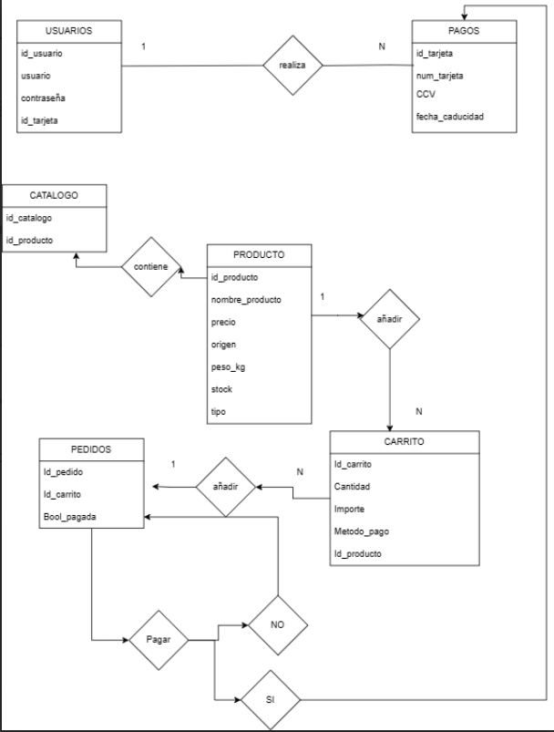

Aquesta es la versió final: 

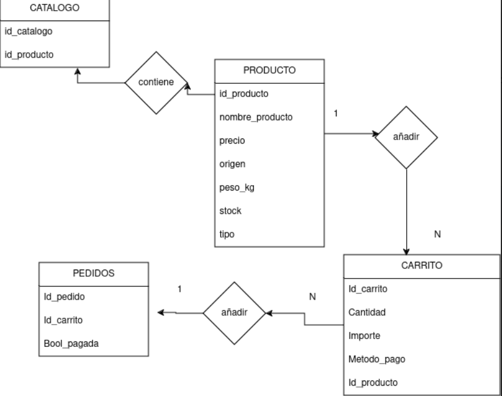

<h2>API CATALEG </h2>

Conté el model de Catàleg i Productes juntament amb els seus serializers per a realitzar les consultes:
<h3> GET PRODUCTE </h3>

<h3> GET PRODUCTES </h3>

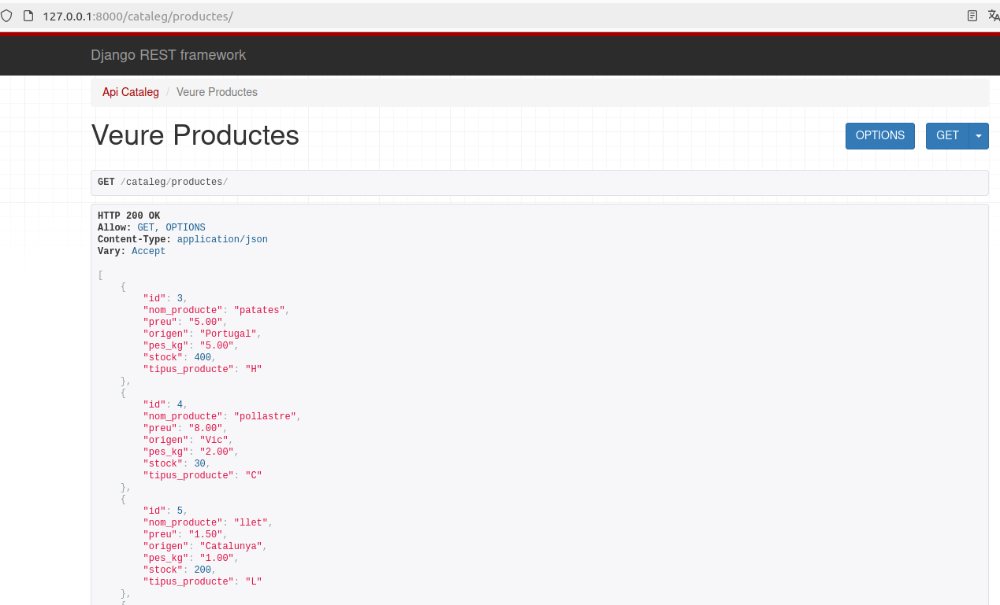

<h3> CREATE PRODUCTE </h3>

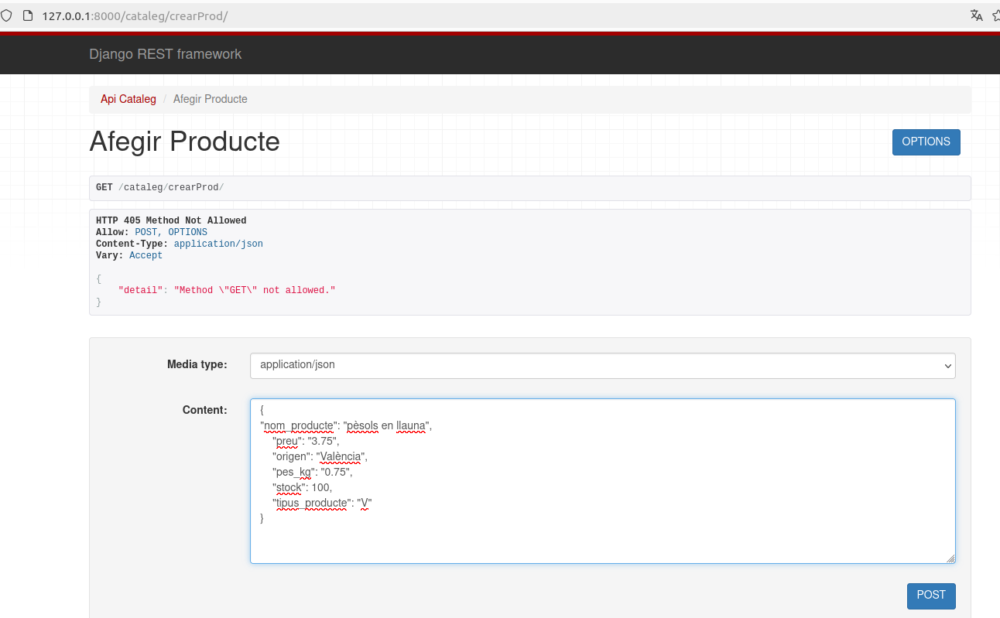

<h3> UPDATE PRODUCTE </h3>

<h3> DELETE PRODUCTE </h3>

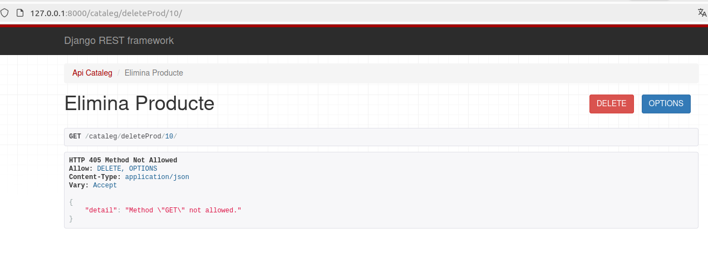
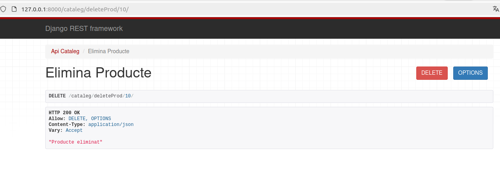

<h3> GET CATALEG </h3>

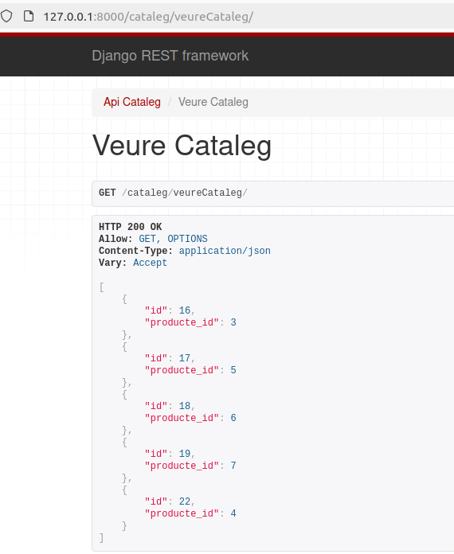

<h3> AFEGIR PRODUCTE AL CATALEG </h3>

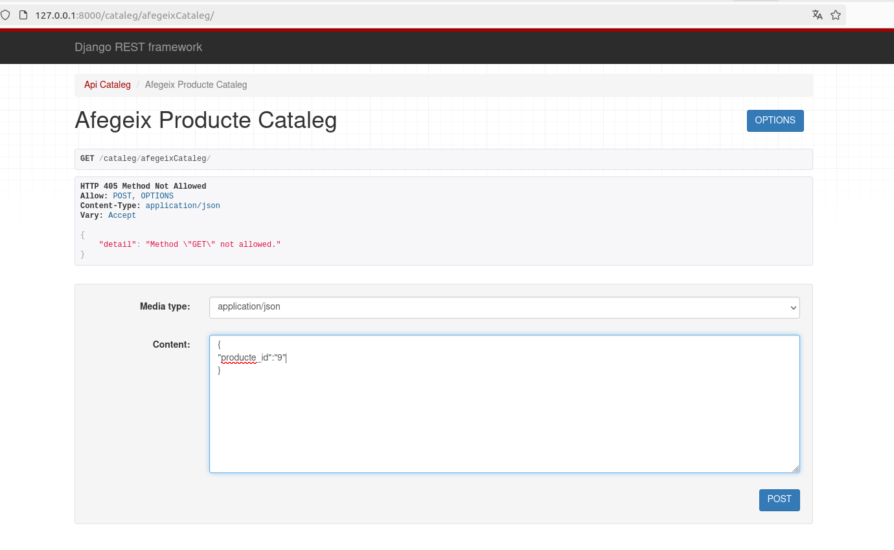
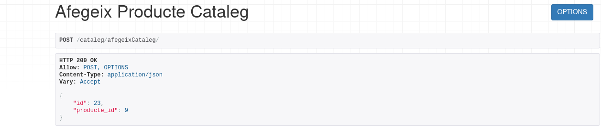

<h3> ELIMINAR PRODUCTE AL CATALEG </h3>

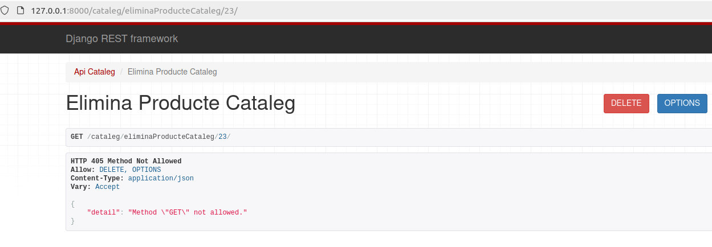
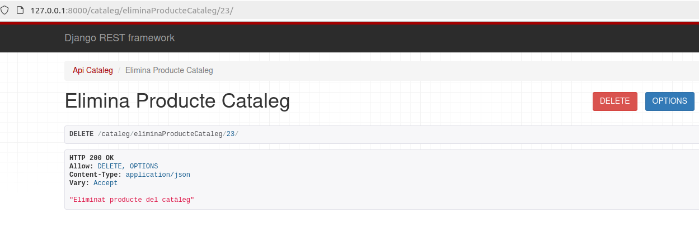

<h2> API PAGAMENTS </h2>

Conté el model de Pagaments amb la view que permet modificar el estat de Carreto en el camp pagat a True

<h3> PAGAR CARRETO </h3>

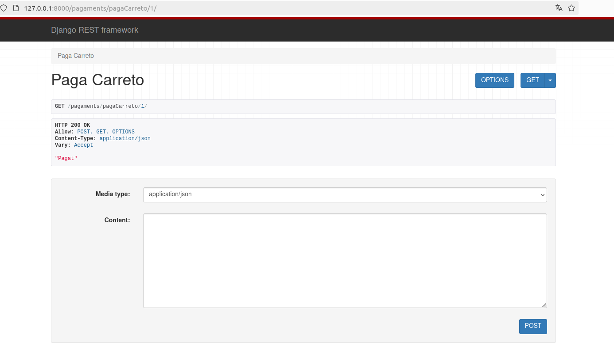
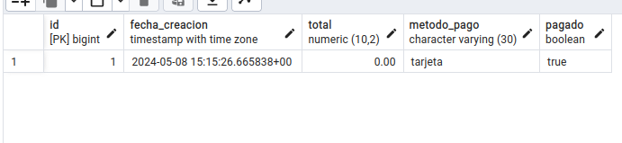

En cas de que el carreto estigui pagat mostrarà el següent missatge: 

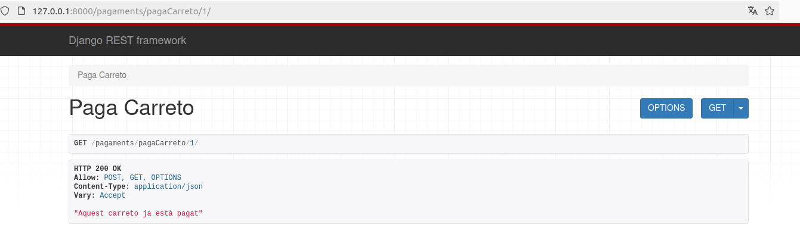