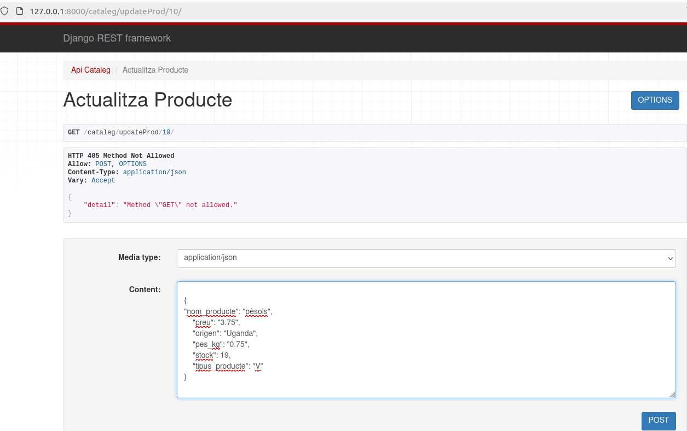

# M07_UF4_P5_Botiga
<h2> Model Entitat-Relació </h2>

<h2>API CATALEG </h2>

Conté el model de Catàleg i Productes juntament amb els seus serializers per a realitzar les consultes:
<h3> GET PRODUCTE </h3>

<h3> GET PRODUCTES </h3>

<h3> CREATE PRODUCTE </h3>

<h3> UPDATE PRODUCTE </h3>

<h3> DELETE PRODUCTE </h3>

<h3> GET CATALEG </h3>

<h3> AFEGIR PRODUCTE AL CATALEG </h3>

<h3> ELIMINAR PRODUCTE AL CATALEG </h3>

