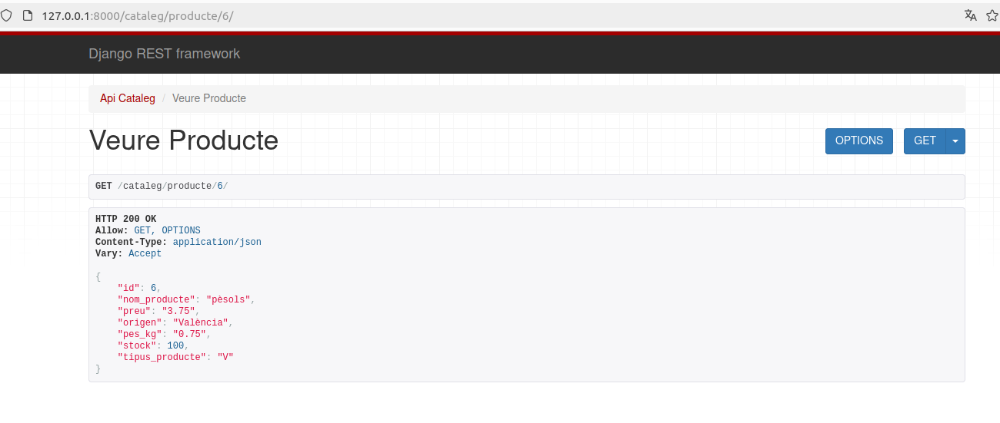
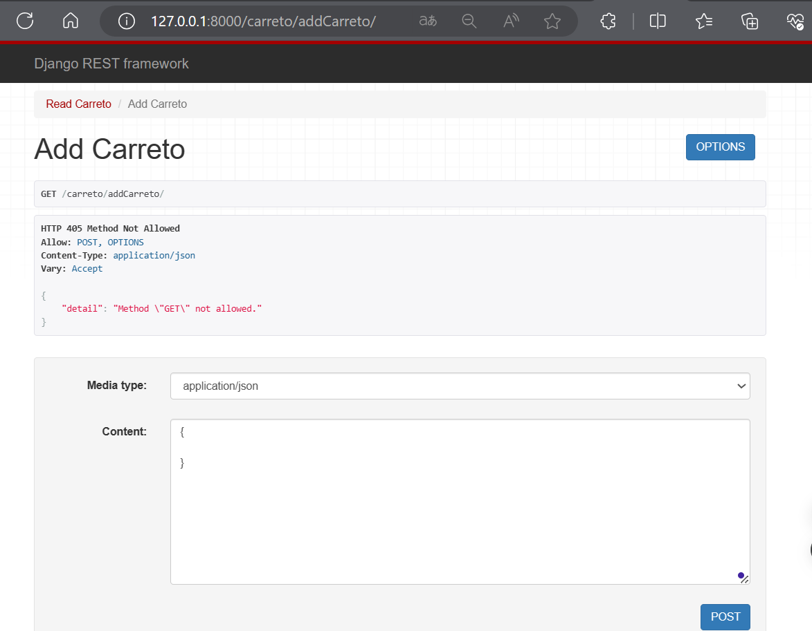
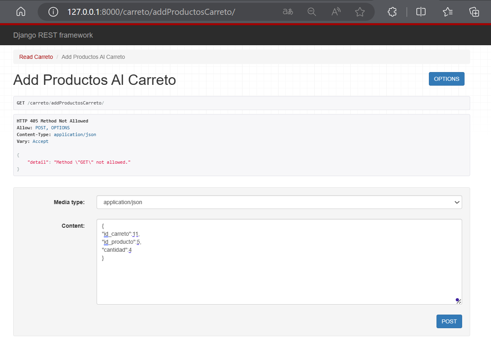

# M07_UF4_P5_Botiga

<h2> Enlace video  </h2>

[link_carpeta_videos_Ejercicio_Botiga](https://drive.google.com/drive/folders/1pimc6uB7hOOn-VYYomya7N910kRowEcn?usp=sharing)

<h2> Model Entitat-Relació </h2>

En aquest model vam partir de la idea de que hi hauria un Login i la api de Pagaments gestionaria el pagament mirant la targeta i l'usuari, al final es va decidir que Pagaments només gestionaria que el carretó sortís com a pagat.

Aquesta es la versió final: 

<h2>API CATALEG </h2>

Conté el model de Catàleg i Productes juntament amb els seus serializers per a realitzar les consultes:
<h3> GET PRODUCTE </h3>

<h3> GET PRODUCTES </h3>

<h3> CREATE PRODUCTE </h3>

<h3> UPDATE PRODUCTE </h3>

<h3> DELETE PRODUCTE </h3>

<h3> GET CATALEG </h3>

<h3> AFEGIR PRODUCTE AL CATALEG </h3>

<h3> ELIMINAR PRODUCTE AL CATALEG </h3>

<h2> API PAGAMENTS </h2>

Conté el model de Pagaments amb la view que permet modificar el estat de Carreto en el camp pagat a True

<h3> PAGAR CARRETO </h3>

En cas de que el carreto estigui pagat mostrarà el següent missatge: 

<h2> CARRETO </h2>

Aplicacion que se encarga de la gestion de los carritos, los articulos de compra, en si es la principal aplicacion que lleva la logica de la aplicación. 

Se describe desde la creacion y eliminacion de un carrito, añadir productos, eliminar el producto y modificar la cantidad.

<h3> Crear carrito</h3>

<h3> Añadir productos al carrito</h3>

<h3> Leer productos del carrito</h3>

<h3> Modificar cantidad de productos del carrito</h3>

<h3> Eliminar producto del carrito</h3>

<h3> Eliminar carrito</h3>

<h2> COMANDAS</h2>

La aplicación comanda nos brinda una vision amplia del estado de los carritos, tanto los pagados y pendientes de pago.

<h3> Read comandas </h3>

<h3> Read historico de carritos pagados</h3>

<h3> Read carritos pendientes</h3>

